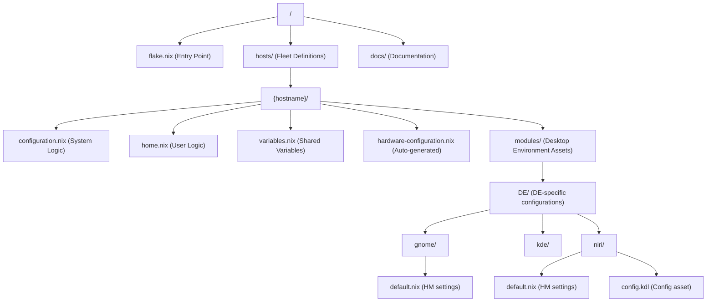

# NixOS Configuration Architecture (Infrastructure & Design)

## 1. ディレクトリ構造とコンポーネント定義

### 1.1 階層構造



### 1.2 構成要素の責務

| コンポーネント      | 役割                                               | 定義方法                              | 出力                     |
| :------------------ | :------------------------------------------------- | :------------------------------------ | :----------------------- |
| `flake.nix`         | 全体の統合、ホストのインスタンス化                 | `nixosConfigurations.{name}`          | NixOS システム定義       |
| `variables.nix`     | 複数ファイルで共有される設定値の一元管理（ユーザー名・DEフラグ等） | `specialArgs` / `extraSpecialArgs` 経由で配布 | 共有変数                 |
| `configuration.nix` | システム権限設定（Boot, HW, Network, Users）       | 関数引数 + `let` 句でローカル変数定義 | NixOS システムオプション |
| `home.nix`          | ユーザー環境設定（Dotfiles, User Packages）        | 関数引数 + `let` 句でローカル変数定義 | Home Manager オプション  |
| `modules/DE/`       | デスクトップ環境固有の構成（HM設定、アセットなど） | 各ディレクトリ内の `default.nix`      | 独立した構成モジュール   |

---

## 2. 実装メカニズムとデータフロー

### 2.1 直接的な構成定義

`flake.nix` で直接 `nixosSystem` を定義する標準的なアプローチを採用しています。これにより、Nix の標準的なドキュメントや例をそのまま適用しやすくなっています。

### 2.2 変数管理

`configuration.nix`、`home.nix`、`flake.nix` の複数ファイルで参照する共有設定値（`username`、`userDisplayName`、`hostname`、`timeZone`、`stateVersion`、`enableGnome`、`displayManager` など）は `variables.nix` で一元管理し、`flake.nix` の `specialArgs` / `extraSpecialArgs` 経由で各モジュールに配布します。各ファイル固有の設定（`isVM`、`gitEmail` など）は引き続き各ファイルの `let` 句で定義します。

> [!NOTE]
> `variables.nix` は「初回セットアップ時に必ず確認する場所」を意圖して設計されています。
> `hostname`、`timeZone`、`stateVersion`、`displayManager` などシステム全体に関わる値は全てここで管理します。

    ```
    variables.nix  →  flake.nix (specialArgs / extraSpecialArgs)
                           ├─ configuration.nix  (関数引数で受け取る: username, hostname, timeZone, stateVersion, displayManager ...)
                           └─ home.nix           (関数引数で受け取る: username, stateVersion, enableGnome ...)
    ```

### 2.3 モジュールの分散管理 (Modular DE Config)

デスクトップ環境（DE）の設定は、`hosts/{hostname}/modules/DE/` 配下の各ディレクトリで完結するように設計されています。

- **自己完結型モジュール**: `default.nix` 内で、その DE に必要なパッケージ（`home.packages`）や設定ファイル（`xdg.configFile`）のシンボリックリンク作成を定義します。
- **相対パスの活用**: 設定コードと実際の設定ファイル（例: `config.kdl`）が同じディレクトリに存在するため、パス指定を `./config.kdl` のように相対パスで記述でき、保守性が向上します。
- **条件付きインポート**: `home.nix` で `lib.optionals` を使用し、`variables.nix` の有効化フラグに基づいてこれらのモジュールを動的にインポートします。

---

## 3. 拡張ガイドライン

### 3.1 新規ホストの追加

1.  **ディレクトリ作成**: 既存の `hosts/desktop` を `hosts/{hostname}` にコピー。
2.  **共有変数の調整**: `hosts/{hostname}/variables.nix` を編集（`username`、`userDisplayName`、デスクトップ環境フラグ等）。
3.  **ローカル変数の調整**: `configuration.nix` の `hostname` 等、`home.nix` の `gitEmail` 等を編集。
4.  **ハードウェア定義**: インストール先で `nixos-generate-config` を実行し、`hardware-configuration.nix` を配置。
5.  **Flake 登録**: `flake.nix` の `outputs.nixosConfigurations` に新しい定義を追加。

### 3.2 アプリケーション設定の追加

1.  **ディレクトリ作成**: `hosts/{hostname}/modules/` 配下に適切なディレクトリを作成。
2.  **`default.nix` の作成**: Home Manager の設定（`xdg.configFile` 等）を記述。
3.  **インポート**: `home.nix` の `imports` リストに作成した `default.nix` のパスを追加。

### 3.3 共通フラグの追加

`configuration.nix` と `home.nix` の**両方**で使うフラグを新たに追加する場合の手順です。

1.  **`variables.nix` に定義**: 新しいフラグと初期値を追加する。

    ```nix
    # hosts/{hostname}/variables.nix
    {
      enableGnome   = true;
      enableNewFlag = false; # ← 追加
    }
    ```

2.  **受け取る側の関数引数に追加**: `configuration.nix` と `home.nix` の両方の先頭引数に、新しいフラグ名を追記する。

    ```nix
    # configuration.nix / home.nix 共通
    { ..., enableNewFlag, ... }:
    ```

3.  **各ファイルで使用**: 通常の変数と同様に参照する。

> [!NOTE]
> `configuration.nix` か `home.nix` の**片方だけ**で使う変数はそのファイルの `let` 句で直接定義するほうが簡潔です。`variables.nix` には両ファイルで共有するものだけを置いてください。

---

## 4. Home Manager 統合と境界線

### 4.1 システム設定 vs ユーザー設定

- **NixOS (configuration.nix)**: ハードウェア、ドライバー、システムサービス、ユーザーアカウント管理、フォント、システムレベルでの DE 有効化フラグ。
- **Home Manager (home.nix / modules/DE/)**: ユーザー固有のパッケージ、アプリケーションの詳細設定、テーマ、DE 内部の構成。
